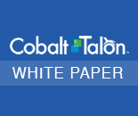

---

#Tackle Big Data with Agile Analytics

[]

Agile Analytics is the prescription for action that health care companies, health care delivery systems and health plans need in order to proffer in today's shifting health care market.

Companies that deploy Agile Analytics find they tackle big data quickly and efficiently. It's this "think big, start small, move fast" approach that health care companies are using to mitigate risk and develop institutional knowledge and control as they work towards peak analytic effectiveness.

The advantages of an Agile Analytics approach are significant, allowing companies to reap benefits without investing millions or waiting years for the return on investment. Help your company leverage it's big data - deploy Agile Analytics today. Download our white paper attachment.

---

[]

#Predictive Insight and Segmentation Solutions

Cobalt Talon offers solutions that enable healthcare companies to accomplish their critical business objectives. Our proven data enrichment process allows us to quickly deliver predictive insights and actionable segmentation methods designed specifically for the healthcare market.

[Read More]

[Read More]: [solutions/overview-predictiveinsights-reliableanswers.html]

---

[]

#Strategic Consulting Services

Cobalt Talon can help you establish or enhance your data management strategy and business intelligence vision with services that bridge the gap between your objectives and the technical solutions that give your health plan better access to the information it needs.

[Read More]

[Read More]: [solutions/overview-strategicconsult.html]

---

[]

#Cobalt Talon: Advanced Analytic Modules

Regardless of how much data your company possesses, it’s useless unless it leads to meaningful information which enables positive business outcomes. Effective data management and analytic solutions can turn today’s complex business and regulatory challenges into new opportunities that differentiate you from the competition.

[Read More]

[Read More]: [solutions/overview-cobalttalon.html]
