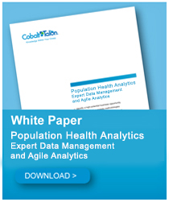

#Tackle Big Data with Agile Analytics

Agile Analytics is the prescription for action that health care companies, health care delivery systems and health plans need in order to proffer in today's shifting health care market.

Companies that deploy Agile Analytics find they tackle big data quickly and efficiently. It's this "think big, start small, move fast" approach that health care companies are using to mitigate risk and develop institutional knowledge and control as they work towards peak analytic effectiveness.

The advantages of an Agile Analytics approach are significant, allowing companies to reap benefits without investing millions or waiting years for the return on investment. Help your company leverage it's big data - deploy Agile Analytics today. Download our white paper attachment.  

***
   
#`Population Health Analytics`

`INSERT BEN AND DARRENS WHITEPAPER HERE`